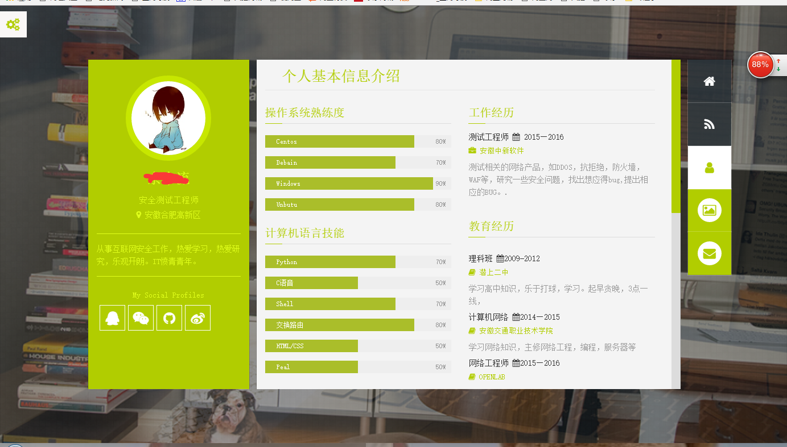
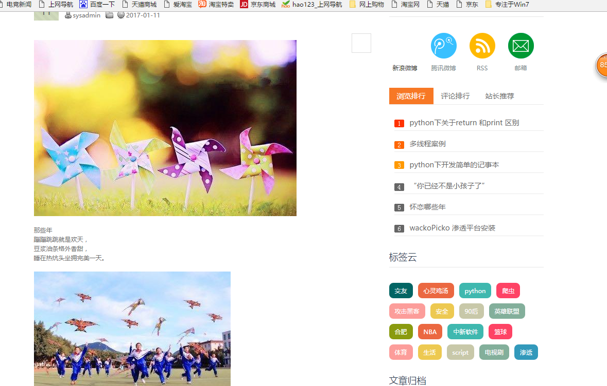
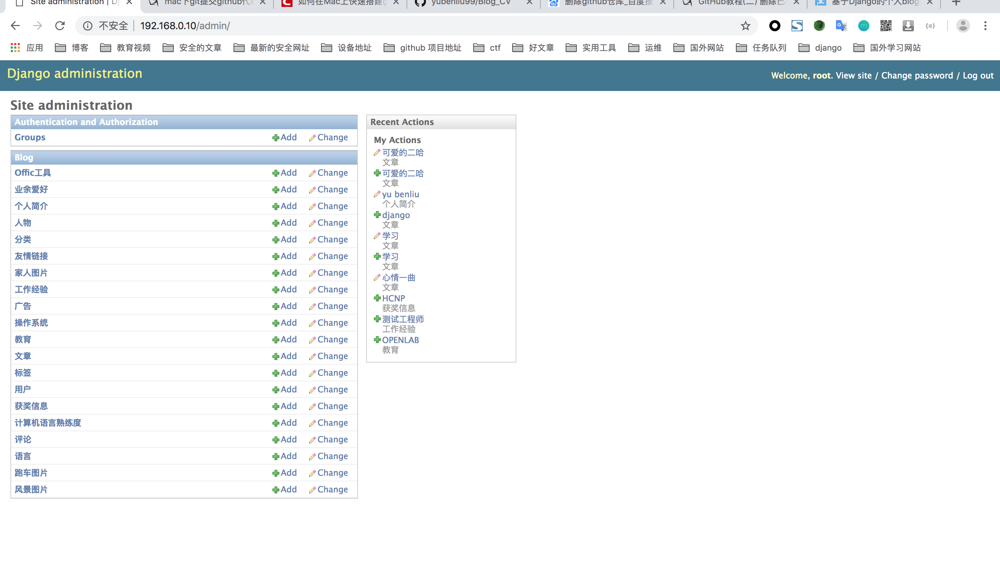

  
   

  
  

  
<strong>个人博客网站,自带网页简历</strong>

  <h1></h1>

**基于Python2.7 django1.9 框架开发**，

## 主要功能：
- 文章，页面，分类目录，标签的添加，删除，编辑等。
- 侧边栏功能，最新文章，最多阅读，标签云等。
- 支持个人简历编写，展示
- 支持个人图库，图片上传分类，浏览

## 项目预览

## 需要改进
* 文章的排版，支持markdown语法高亮

## 项目截图

## License
 

[MIT](https://opensource.org/licenses/MIT)，享受开源的乐趣
